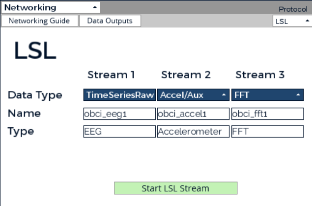

# NXT Data Collector

> The Data Collector is a graphical user interface to record participant EEG data. A researcher will run tests that prompt the participant to imagine motor impulses using audiovisual cues. The data from the OpenBCI LSL stream will be recorded, labeled, and saved to a folder hierarchy of all participants, sessions, and trials after a manual visual confirmation by the researcher.

### Current Version: [[1.1.0-b] - 2/17/2024](docs/changelog.md)

## Download & Install

### Git

```bash
$ git clone https://github.com/Neurotechnology-Exploration-Team/DataCollector.git
$ cd DataCollector/
$ pip install -r requirements.txt
```

### Software Requirements

- Python v3.12.x
- [Standalone OpenBCI GUI](https://openbci.com/downloads) v5.2.2 (Required to interact with LSL stream data)
    - MacOS & Linux users will need to install [liblsl](https://github.com/sccn/liblsl); OpenBCI only ships with the
      library on Windows.

## Usage

> You will first need to set up LSL streams for the Data Collector to interface with.

### LSL Streaming

Launch **`OpenBCI_GUI.exe`**

Select data source type from **`System Control Panel > DATA SOURCE`**.

- Real-Time LSL Data: Select **`CYTON (Live)`**
  - To configure OpenBCI/set up the Cyton board communication, follow steps III and IV from the [OpenBCI Cyton setup instructions](https://docs.openbci.com/GettingStarted/Boards/CytonGS/#iii-prepare-your-openbci-hardware).
  - To set up EEG hardware, use the [OpenBCI EEG setup guide](https://docs.openbci.com/GettingStarted/Biosensing-Setups/EEGSetup/).
- Algorithmic LSL Data **(USE FOR TESTING ONLY)**: Select **`SYNTHETIC (Algorithmic)`**

Leave all settings as default, and press **`START SESSION`**

Setup LSL Stream

- Change one of the widgets to **`Networking`**
- Change protocol to **`LSL`**
- Configure the Networking Window as follows:

> 

Press **`Start LSL Stream`** to activate the LSL stream on the local network. Press **`Start Data Stream`** to begin
streaming test data.

> The LSL streams are now streaming on your laptop. Press **`Stop LSL Stream`** and **`Stop Data Stream`** when
> complete.

### Data Collection

> Once the LSL streams have been established, the data collection process can be initiated

Run main.py to run all tests and record data.

```bash
$ python main.py
```

- Clicking on the button to start each test will display the test in the display window.
- After each test, a confirmation window will appear with the recorded data.
- Each trial will be saved to `<DATA_PATH>/PXXX/SXXX/trial_XX/<STREAM_TYPE>_date.csv` (see [config.py](./config.py) for additional configuration)
  - Each LSL stream will be saved to a separate CSV file. There should be no blank values.
- Once all tests have been completed, the window will automatically close.

> By default, only EEG data is recorded. To enable other data streams, modify the `SUPPORTED_STREAMS` booleans in 
> `config.py`.

## Contributors

**Principal Investigator:** [Alex Burbano](mailto:arb8590@rit.edu)

**Research Team:**

- [Akhil Devarapalli](mailto:ad7171@rit.edu)
- [Ian Dunn](mailto:itd3516@rit.edu)
- [Mack Leonard](mailto:mml2034@rit.edu)
- [Matt London](mailto:mrl2534@rit.edu)

### How to Contribute

**Bugs:** Any bugs found should be opened as an issue. If you're able to after creating the issue, feel free to assign yourself
and start working on it! Otherwise, the current development team will look into it.

**Features:** Any unassigned, open issues are free game for any team member. There is usually more detailed instructions
in the issue. If you have an idea for a new feature, create an issue or fork of the repository.

> Any contributions MUST have a **pull request** and **changelog** before being merged into dev (main for hotfixes).